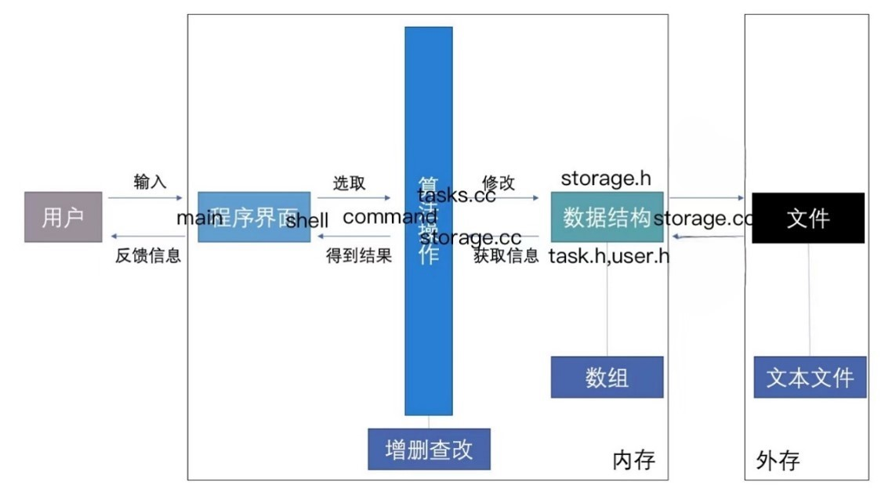
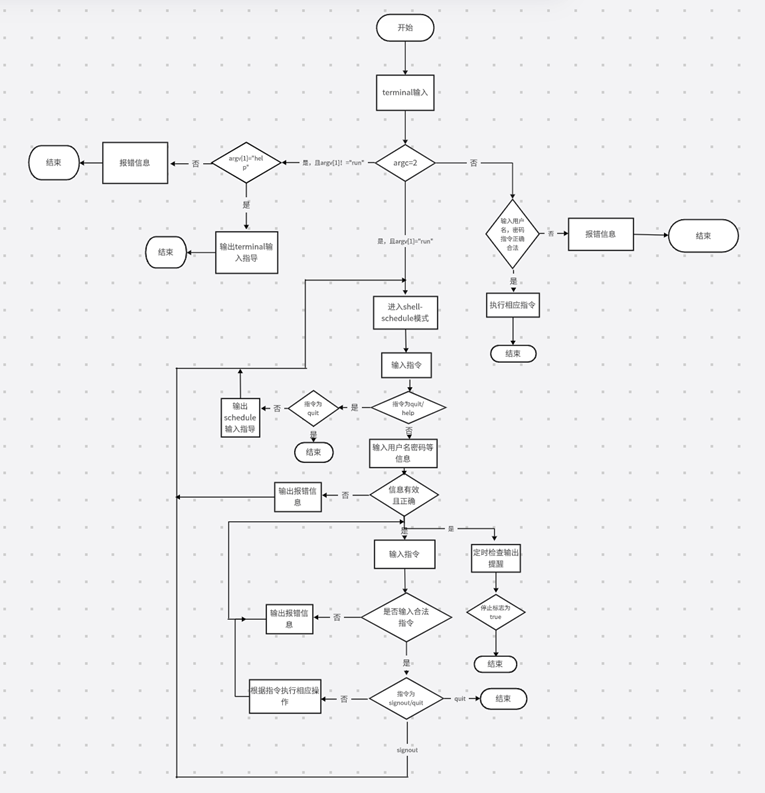

# 日程管理系统设计文档

## 一、小组成员及分工

[YuanFhj](https://github.com/YuanFhj)：构架设计、Tasks类和Storage类的设计、用户接口设计、多线程

[pipi2023](https://github.com/pipi2023)：构架设计、User类的设计、多线程、用户接口设计、设计文档

## 二、模块与类的设计

整体思路：一个用户一个文件，文件中储存用户信息和任务。

利用模块化的编程方式，每个模块都有明确的职责，并且适当进行封装，有助于保持代码的整洁和可读性，同时也便于团队协作和后期的代码维护。遵循了面向对象编程的原则，使代码结构清晰、易于扩展和维护。

1.  User类（大写u）：  
    增加HashedPassword结构体以便密码管理  
    功能：储存用户信息，标签管理，密码管理  
2.  Tasks类:  
    增加Task结构体储存单个任务信息  
    封装和管理一个用户的所有任务，通过Storage实例来访问和操作任务数据  
    功能：数据访问、任务选择、任务排序  
3.	Storage类：  
    管理与用户账户和任务相关的数据存储  
    功能：用户管理、任务管理、状态检查  
4.	Terminal类：  
    根据输入的指令，在终端界面完成相应操作  
5.	schedule类：
    进入shell模式后，使用户可以在登录/注册界面进行登录/注册等操作  
6.	user类（小写u）：  
    用户登录后进入用户交互界面，根据用户输入的指令完成相应操作，同时定时检查，进行任务提醒。
7.	主模块：  
    启动程序，可以单次执行一条指令，或者进入shell后，为用户提供多次输入指令并执行的服务，同时利用多线程定时检查任务，在约定的提醒时间进行提醒。
8.	程序框架：  
    三个界面：终端界面，登录/注册界面，用户操作界面，分别在三个界面对应的后端进行操作（不同命名空间进行模块划分，内部调用相应指令的函数）。

## 三、流程图

## 四、关键技术
1.	文件内容读写操作
    使用内存映射文件，内部使用一个文件描述符（fd）来关联一个文件，通过mapping指针映射文件到内存中，无需显式地读取或写入文件。内存映射文件允许将磁盘上的文件直接映射到进程的虚拟地址空间中，这样对文件的操作就变成了对内存的直接读写操作，极大地提高了文件I/O的效率和性能。  
2.	输入输出
    利用std::ios::sync_with_stdio(false);防止输入命令的时候把提醒线程阻塞，提升读写速度。C++为了兼容C，保证程序在使用std::printf和std::cout的时候不发生混乱，将输出流绑到了一起。cin，cout之所以效率低，是因为先把要输出的东西存入缓冲区，再输出，导致效率降低。而ios::sync_with_stdio(false);可以不经过输入输出缓存，可以节省许多时间，使效率与scanf与printf相差无几。  
    命令处理时同样用到unordered_map将不同的命令字符串映射到不同的函数，使代码更加简洁美观，分别阅读和维护。  
3.	用户密码加密
    引入“HASH”子模块，利用SHA-512对用户密码进行加密保存。SHA-512属于SHA (Secure Hash Algorithm，译作安全散列算法) 是美国国家安全局 (NSA) 设计，美国国家标准与技术研究院 (NIST) 发布的一系列密码散列函数，目前仍为安全的加密算法，未被破译。  
    同时输入密码时调用getpass函数在用户输入密码时避免显示明文，进一步提高安全性。  
4.	多线程
    为避免用户输入操作和定时提醒之间的冲突，利用多线程的方式使这两个线程共享相同的程序资源和内存空间，可以并行或并发地执行不同的任务或同一任务的不同部分。为解决多线程数据共享存在的数据竞争问题，本程序采用加锁的方式，引入<pthread.h>库中的锁，在插入数据和定时提醒的时候进行加锁，以免非法访问内存，修改数据。  
5.	文件创建
    使用hex_encode(const char*raw,char*encoded)将二进制字符串变为十六进制储存。如果直接发送包含特殊字符（如‘/’等）的路径名，系统可能会误解这些字符的意义，导致解析出错。通过将路径名转换为十六进制，所有字符都被明确地表示为无歧义的十六进制数字和字母组合，这样可以防止系统错误地解析路径名中的特殊字符。  
